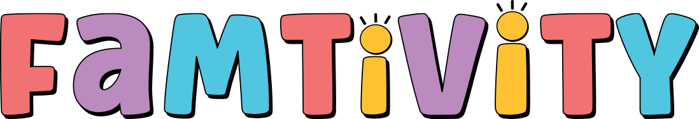

<!-- Improved compatibility of back to top link: See: https://github.com/othneildrew/Best-README-Template/pull/73 -->

<a id="readme-top"></a>

<!--
*** Thanks for checking out the Best-README-Template. If you have a suggestion
*** that would make this better, please fork the repo and create a pull request
*** or simply open an issue with the tag "enhancement".
*** Don't forget to give the project a star!
*** Thanks again! Now go create something AMAZING! :D
-->

<!-- PROJECT SHIELDS -->
<!--
*** I'm using markdown "reference style" links for readability.
*** Reference links are enclosed in brackets [ ] instead of parentheses ( ).
*** See the bottom of this document for the declaration of the reference variables
*** for contributors-url, forks-url, etc. This is an optional, concise syntax you may use.
*** https://www.markdownguide.org/basic-syntax/#reference-style-links
-->

[![Contributors][contributors-shield]][contributors-url]
[![Forks][forks-shield]][forks-url]
[![Stargazers][stars-shield]][stars-url]
[![Issues][issues-shield]][issues-url]
[![MIT License][license-shield]][license-url]
[![LinkedIn][linkedin-shield]][linkedin-url]

<!-- PROJECT LOGO -->
<br />
<div align="center">
  <a href="https://github.com/lindsay-renna/lindsay-renna-capstone">
    
  </a>

<h3 align="center">FamTivity</h3>

  <p align="center">
    FamTivity is an innovative web application designed to help families plan custom family nights based on their preferences, the number of children, and their ages. This project aims to bring families closer by providing tailored activity suggestions that cater to the unique dynamics of each family. <br /><br /> This is the backend server that supports the front-end application found at <a href="https://github.com/lindsay-renna/lindsay-renna-capstone">lindsay-renna-capstone</a>
    <br /><br />
    <a href="https://github.com/lindsay-renna/lindsay-renna-capstone"><strong>Explore the docs »</strong></a>
    <br />
    <br />
    <a href="https://github.com/lindsay-renna/lindsay-renna-capstone">View Demo</a>
    ·
    <a href="https://github.com/lindsay-renna/lindsay-renna-capstone/issues/new?labels=bug&template=bug-report---.md">Report Bug</a>
    ·
    <a href="https://github.com/lindsay-renna/lindsay-renna-capstone/issues/new?labels=enhancement&template=feature-request---.md">Request Feature</a>
  </p>
</div>

<!-- TABLE OF CONTENTS -->
<details>
  <summary>Table of Contents</summary>
  <ol>
    <li>
      <a href="#about-the-project">About The Project</a>
      <ul>
        <li><a href="#built-with">Built With</a></li>
      </ul>
    </li>
    <li>
      <a href="#getting-started">Getting Started</a>
      <ul>
        <li><a href="#prerequisites">Prerequisites</a></li>
        <li><a href="#installation">Installation</a></li>
      </ul>
    </li>
    <li><a href="#usage">Usage</a></li>
    <li><a href="#roadmap">Roadmap</a></li>
    <li><a href="#contributing">Contributing</a></li>
    <li><a href="#license">License</a></li>
    <li><a href="#contact">Contact</a></li>
    <li><a href="#acknowledgments">Acknowledgments</a></li>
  </ol>
</details>

<!-- ABOUT THE PROJECT -->

## About The Project

This app is designed for:

- Families with children of various ages seeking to enhance their quality time together.
- Parents looking for easy and convenient ways to plan engaging activities.
- Caregivers and educators interested in structured yet fun family activities.

<p align="right">(<a href="#readme-top">back to top</a>)</p>

## Features

- User registration and authentication
- User maintained WatchList to remove watched movies from future results
- Top 10 / popular movie/videogame/board games for families

## Tech Stack

- **Client:** React
- **Server:** Node, Express
- **Database:** MySQL
- **Authentication:** OAuth, Passport.js
- **APIs:** Movie and Video Game APIs for data retrieval, custom boardgame API using MySQL database

## API Endpoints

**Authentication**
GET /auth/github - Initiates GitHub OAuth authentication
GET /auth/github/callback - Handles the callback from GitHub after authentication.

GET /auth/google - Initiates Google OAuth authentication
GET /auth/google/callback - Handles the callback from Google after authentication

GET /auth/profile - Retrieves the authenticated user's profile information
GET /auth/logout - Logs out the authenticated user

**User Profile**
GET /users/:userId/watched-list - Retrieves the list of watched movies for a specific user
POST /users/watched-list/add - Adds a movie to the user's watched list
DELETE /users/:movieId - Removes a movie from the user's watched list

**Boardgames**
GET /boardgames - Get first 40 boardgames
GET /boardgames/popular - Get listing of popular boardgames for families
GET /boardgames/id - Get boardgame details by boardgame ID
POST /boardgames/results - Return a result of boardgames matching query params
(Expand this section with more details about each endpoint as needed)

<p align="right">(<a href="#readme-top">back to top</a>)</p>

<!-- GETTING STARTED -->

## Getting Started

To get a local copy up and running follow these simple steps:

### Prerequisites

- Node.js (>=14.x.x)
- git
- MySQL

### Installation

1. Clone the repo
   ```sh
   git clone https://github.com/lindsay-renna/lindsay-renna-capstone-api.git
   ```
2. Install dependencies
   ```sh
   npm install
   ```
3. Create a new .env file with the following variables (see .env.example in the root folder). Replace the values with your values and local frontend PORT of choice

   ```js
   //Port number on which the server will run
    PORT=8080

    //MySQL database connection settings
    DB_HOST=your_database_host
    DB_USER=your_database_user
    DB_PASSWORD=your_database_password
    DB_NAME=your_database_name

    //Session secret key for session management
    //You can enter any random string or word but to make it more secure you can generate one
    //generated by `node -e "console.log(require('crypto').randomBytes(32).toString('hex'));"`
    SESSION_SECRET=your_session_secret

    //GitHub Auth credentials
    GITHUB_CLIENT_ID=your_github_client_id
    GITHUB_CLIENT_SECRET=your_github_client_secret
    GITHUB_CALLBACK_URL=your_github_callback_url

    //Google Auth credentials
    GOOGLE_CLIENT_ID=your_google_client_id
    GOOGLE_CLIENT_SECRET=your_google_client_secret
    GOOGLE_CALLBACK_URL=your_google_callback_url

    //React App
    CLIENT_URL=http://localhost:5173
   ```

4. Open a new terminal window and start the backend server.
   ```sh
   npm run start
   ```
5. Complete the instructions fom the front-end repo.
6. The application should now be running on http://localhost:5173 (frontend) and http://localhost:8080 (backend).

## Database Setup

1. Import the SQL file: Import the provided SQL file into your MySQL database. You can use a tool like MySQL Workbench or run the following command in your terminal:

```bash
mysql -u your_database_user -p your_database_name < path/to/your/sql/file.sql
```

2. Configure Knex: Create a knexfile.js in the root directory with the following content:

```js
// knexfile.js
module.exports = {
	development: {
		client: "mysql",
		connection: {
			host: process.env.DB_HOST,
			user: process.env.DB_USER,
			password: process.env.DB_PASSWORD,
			database: process.env.DB_NAME,
		},
		migrations: {
			tableName: "knex_migrations",
		},
	},
	production: {
		client: "mysql",
		connection: {
			host: process.env.DB_HOST,
			user: process.env.DB_USER,
			password: process.env.DB_PASSWORD,
			database: process.env.DB_NAME,
		},
		migrations: {
			tableName: "knex_migrations",
		},
	},
};
```

3. Run Migrations: Ensure you have configured your knexfile.js correctly. Then run:

```bash
npx knex migrate:latest
```

4. Run Seeds: To populate the database with initial data, run:
<p align="right">(<a href="#readme-top">back to top</a>)</p>

<!-- USAGE EXAMPLES -->

## Usage

Use this space to show useful examples of how a project can be used. Additional screenshots, code examples and demos work well in this space. You may also link to more resources.

<p align="right">(<a href="#readme-top">back to top</a>)</p>

<p align="right">(<a href="#readme-top">back to top</a>)</p>

<!-- CONTRIBUTING -->

## Contributing

Contributions are what make the open source community such an amazing place to learn, inspire, and create. Any contributions you make are **greatly appreciated**.

If you have a suggestion that would make this better, please fork the repo and create a pull request. You can also simply open an issue with the tag "enhancement".
Don't forget to give the project a star! Thanks again!

1. Fork the Project
2. Create your Feature Branch (`git checkout -b feature/AmazingFeature`)
3. Commit your Changes (`git commit -m 'Add some AmazingFeature'`)
4. Push to the Branch (`git push origin feature/AmazingFeature`)
5. Open a Pull Request

<p align="right">(<a href="#readme-top">back to top</a>)</p>

<!-- LICENSE -->

## License

Distributed under the MIT License. See `LICENSE.txt` for more information.

<p align="right">(<a href="#readme-top">back to top</a>)</p>

<!-- CONTACT -->

## Contact

Lindsay Renna - lrenna.oct@gmail.com

Project Link: [https://github.com/lindsay-renna/lindsay-renna-capstone-api](https://github.com/lindsay-renna/lindsay-renna-capstone-api)

<p align="right">(<a href="#readme-top">back to top</a>)</p>

<!-- ACKNOWLEDGMENTS -->

## Acknowledgments

- [https://recommend.games](Markus Shepherd of recommend.games for the scraped boardgame data)

<p align="right">(<a href="#readme-top">back to top</a>)</p>

<!-- MARKDOWN LINKS & IMAGES -->
<!-- https://www.markdownguide.org/basic-syntax/#reference-style-links -->

[contributors-shield]: https://img.shields.io/github/contributors/lindsay-renna/lindsay-renna-capstone.svg?style=for-the-badge
[contributors-url]: https://github.com/lindsay-renna/lindsay-renna-capstone/graphs/contributors
[forks-shield]: https://img.shields.io/github/forks/lindsay-renna/lindsay-renna-capstone.svg?style=for-the-badge
[forks-url]: https://github.com/lindsay-renna/lindsay-renna-capstone/network/members
[stars-shield]: https://img.shields.io/github/stars/lindsay-renna/lindsay-renna-capstone.svg?style=for-the-badge
[stars-url]: https://github.com/lindsay-renna/lindsay-renna-capstone/stargazers
[issues-shield]: https://img.shields.io/github/issues/lindsay-renna/lindsay-renna-capstone.svg?style=for-the-badge
[issues-url]: https://github.com/lindsay-renna/lindsay-renna-capstone/issues
[license-shield]: https://img.shields.io/github/license/lindsay-renna/lindsay-renna-capstone.svg?style=for-the-badge
[license-url]: https://github.com/lindsay-renna/lindsay-renna-capstone/blob/master/LICENSE.txt
[linkedin-shield]: https://img.shields.io/badge/-LinkedIn-black.svg?style=for-the-badge&logo=linkedin&colorB=555
[linkedin-url]: https://linkedin.com/in/lindsay-renna
[product-screenshot]: images/screenshot.png
